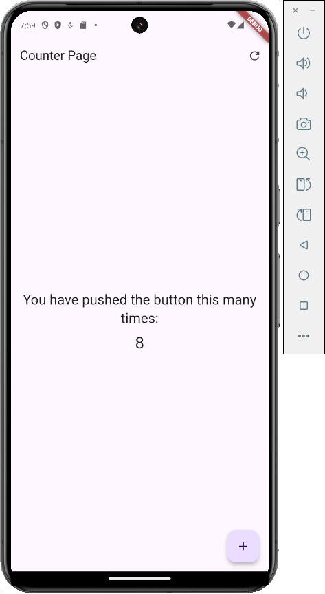

# Flutter Counter App with Clean Architecture

  

A Flutter counter application implementing Clean Architecture principles and Provider state management. This project serves as a demonstration of best practices in Flutter development.

## 🌟 Features

- Clean Architecture implementation
- Provider state management
- Constant management for strings
- Proper code documentation
- Separation of concerns
- Immutable state management
- Reset functionality
- Material Design 3

## 🏗️ Architecture

The project follows Clean Architecture principles with the following structure:

## 📱 Usage

The app provides a simple interface with the following features:

- Tap the floating action button (➕) to increment the counter
- Tap the refresh button (🔄) in the app bar to reset the counter to zero
- The current count is displayed prominently in the center of the screen

## 🛠️ Technical Details

### State Management

The app uses Provider for state management, demonstrating:

- Immutable state updates
- Proper state encapsulation
- Efficient widget rebuilds

### Clean Architecture Benefits

- **Separation of Concerns**: Each layer has its specific responsibility
- **Maintainability**: Easy to modify and extend
- **Testability**: Architecture designed with testing in mind
- **Scalability**: Easy to add new features

## 📚 Dependencies

- [provider](https://pub.dev/packages/provider): ^6.0.5 - For state management
- [flutter_lints](https://pub.dev/packages/flutter_lints): ^4.0.0 - For consistent code styling

## 🤝 Contributing

1. Fork the Project
2. Create your Feature Branch (`git checkout -b feature/AmazingFeature`)
3. Commit your Changes (`git commit -m 'Add some AmazingFeature'`)
4. Push to the Branch (`git push origin feature/AmazingFeature`)
5. Open a Pull Request

## 📝 License

This project is licensed under the MIT License - see the [LICENSE](LICENSE) file for details.

## 👤 Author

Survil Dhaduk

- GitHub: [@survil-dhaduk](https://github.com/survil-dhaduk)
- LinkedIn: [Survil Dhaduk](https://www.linkedin.com/in/survil-dhaduk/)

## ⭐ Show your support

Give a ⭐️ if this project helped you!

## 📸 Screenshots

  
  

